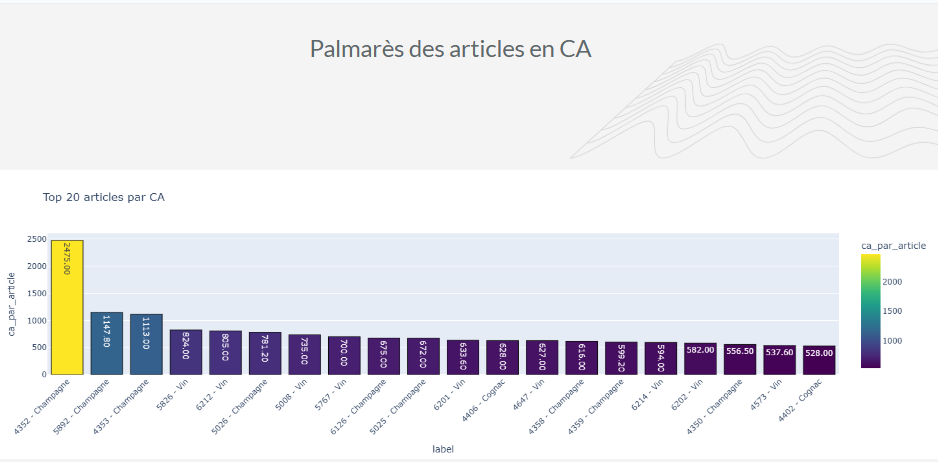
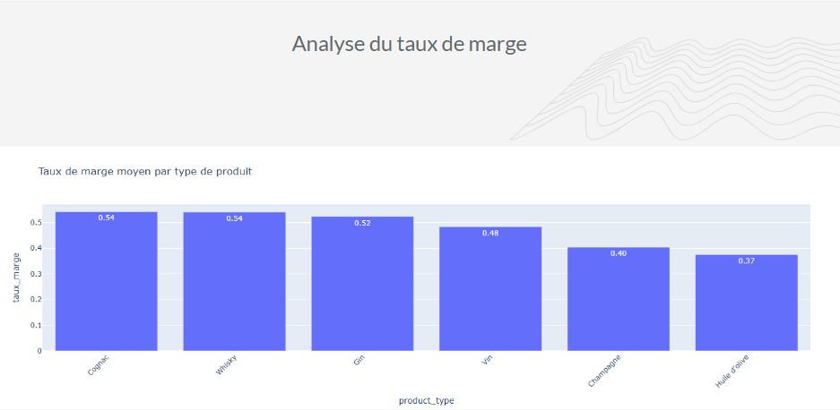
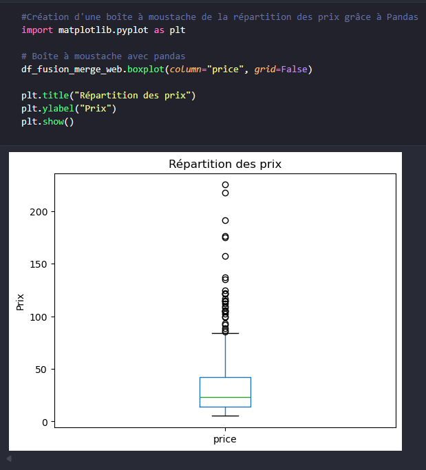
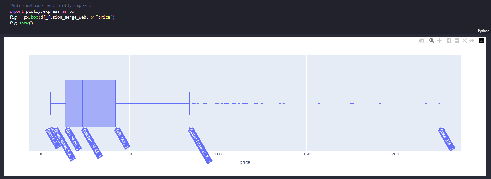
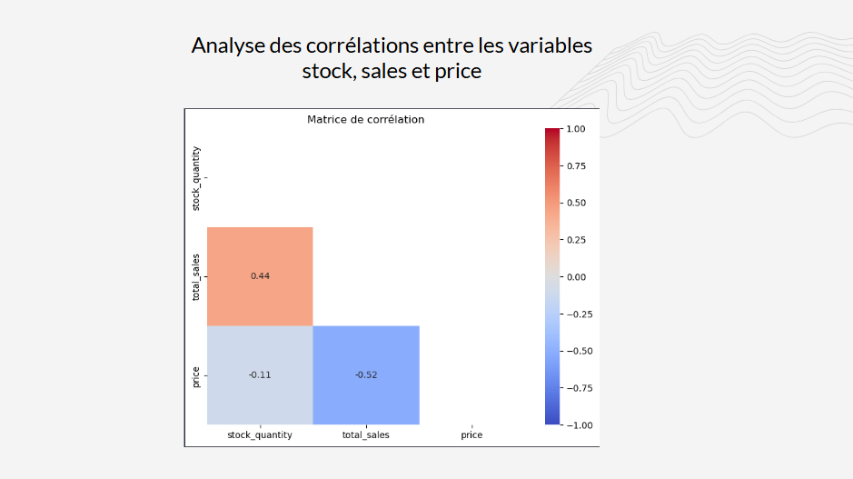

[Version française en bas / French version below]

# Optimization and Data Analysis of a Retail Store

## 🎯 Project Objective

This project consists of cleaning, merging, and analyzing retail store data in order to improve data quality and reliably leverage business information.

The goal was also to answer several questions related to sales, inventory, and revenue.

---

## 📂 Data Used

The project is based on several Excel files:

- ERP file
- web file
- linkage file

This data was processed and merged using Python to obtain a consistent view of the business activity.

---

## 🧹 Data Cleaning

The data preparation work included:

- correcting inconsistent data
- handling missing values
- standardizing formats
- checking data quality

This step helps improve the reliability of analyses and ensures consistent results.

---

## 🔗 Data Merging and Linking

Joins were performed between the different data sources in order to:

- link products across files
- cross sales, stock, and product information
- obtain a global view of the business activity

---

## 📊 Analyses Performed

The analyses focused on:

- product revenue
- profit margins
- price distribution
- correlations between sales, stock, and prices

Visualizations were created to identify trends and outliers.

---

## 🛠️ Technologies Used

- Python
- Pandas
- NumPy
- Matplotlib
- Plotly Express
- Excel

---

## 📌 Conclusion

This project helped me develop my skills in data cleaning, dataset merging, and business data analysis using Python.

---

## 📷 Charts Overview

Product revenue ranking :

Profit margin analysis :

Creation of a boxplot showing price distribution using Pandas :

Alternative method using Plotly Express :

Correlation analysis between stock, sales and price variables :

> This repository presents a portfolio version of the project. Some implementation details and calculations are intentionally not included.

---

# Optimisation et analyse des données d’une boutique

## 🎯 Objectif du projet

Ce projet consiste à nettoyer, fusionner et analyser les données d’une boutique afin d’améliorer la qualité des données et d’exploiter les informations commerciales de manière fiable.

L’objectif était également de répondre à plusieurs problématiques liées aux ventes, aux stocks et au chiffre d’affaires.

---

## 📂 Données utilisées

Le projet repose sur plusieurs fichiers Excel :

- fichier ERP
- fichier web
- fichier de liaison

Ces données ont été exploitées et fusionnées avec Python afin d’obtenir une vision cohérente de l’activité commerciale.

---

## 🧹 Nettoyage des données

Le travail de préparation des données comprenait :

- la correction des données incohérentes
- le traitement des valeurs manquantes
- l’uniformisation des formats
- la vérification de la qualité des données

Cette étape permet d’améliorer la fiabilité des analyses et de garantir des résultats cohérents.

---

## 🔗 Fusion et rapprochement des données

Des jointures ont été réalisées entre les différentes sources de données afin de :

- relier les produits entre les fichiers
- croiser les ventes, les stocks et les informations produits
- obtenir une vision globale de l’activité

---

## 📊 Analyses réalisées

Les analyses ont porté sur :

- le chiffre d’affaires des produits
- les taux de marge
- la répartition des prix
- les corrélations entre ventes, stocks et prix

Des visualisations ont été réalisées afin d’identifier les tendances et les valeurs atypiques.

---

## 🛠️ Technologies utilisées

- Python
- Pandas
- NumPy
- Matplotlib
- Plotly Express
- Excel

---

## 📌 Conclusion

Ce projet m’a permis de développer mes compétences en nettoyage de données, en fusion de datasets et en analyse commerciale avec Python.

---

## 📷 Aperçu des graphiques

> Ce dépôt présente une version portfolio du projet. Certains détails d'implémentation et calculs ne sont volontairement pas inclus.
